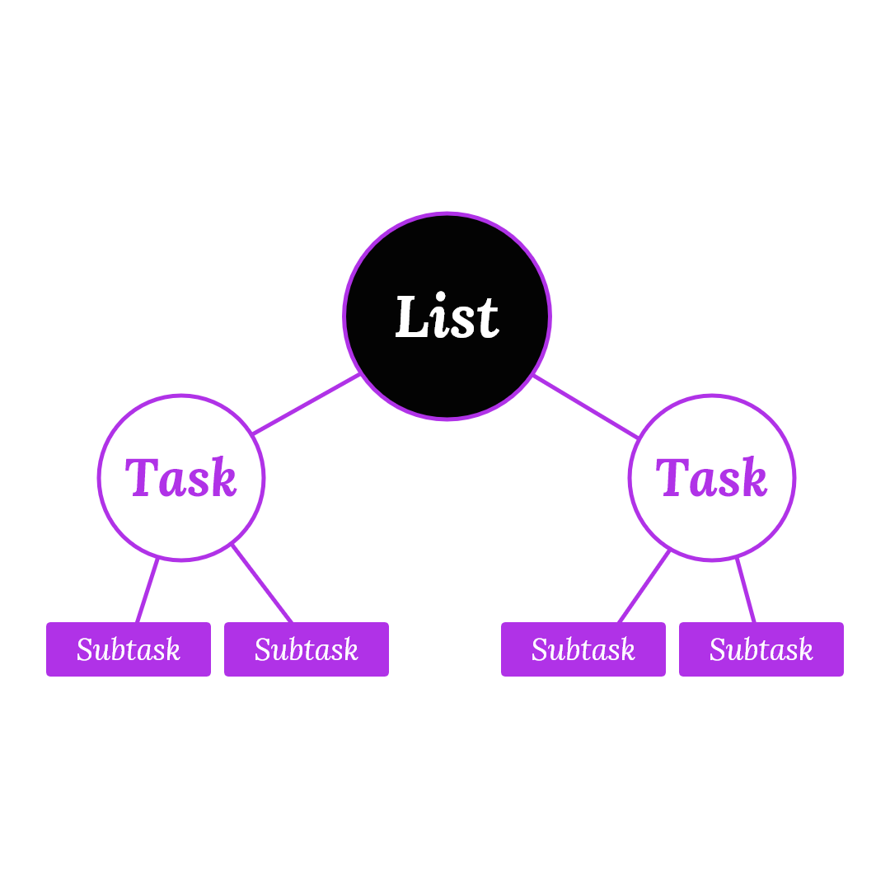
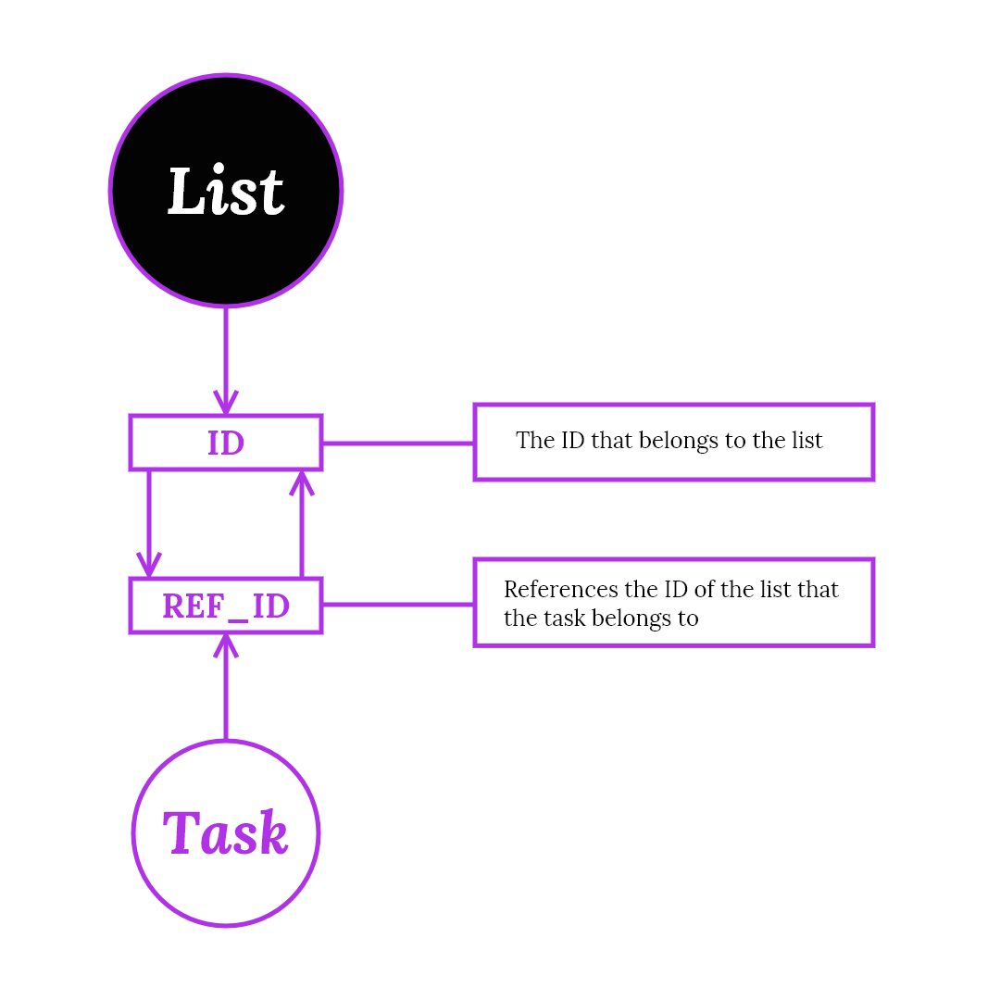
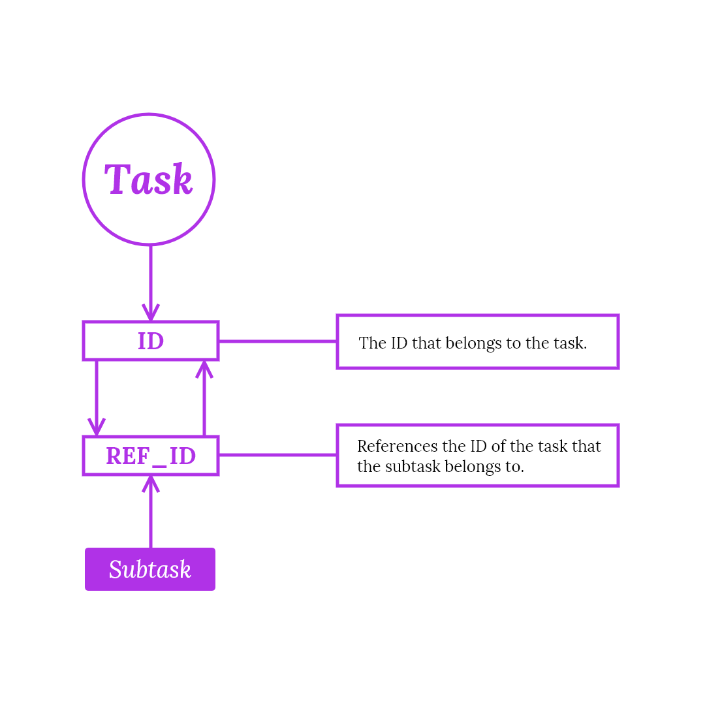

# **THEKAT.**

Thekat is a task web application that enables users to create a list(s) that contains a collection of tasks.

## **_Resources_**

- **`React.js`**: A JavaScript library.

- **`LocalStorage`**: The browsers local storage is used for persisting the data. This has a limitation where the data is only retained in that browser.

## **_How it works_**

```
1.  Create a list.
2.  Add a task to the list.
3.  Add a subtask to the task.
```



A list can have multiple tasks but a task can belong to only a singular list.

A `ref_id` that references the `id` of the list that the task belongs to is used to associate the task to the list.



A task can optionally have multiple subtasks but a subtask can belong to only one task.

A `ref_id` that references the `id` of the task that the subtask belongs to is used to associate the subtask to the task.


